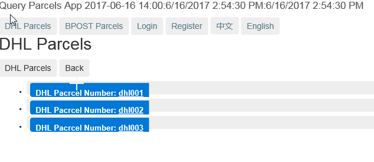
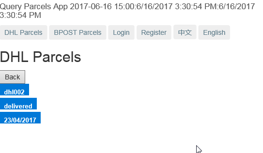
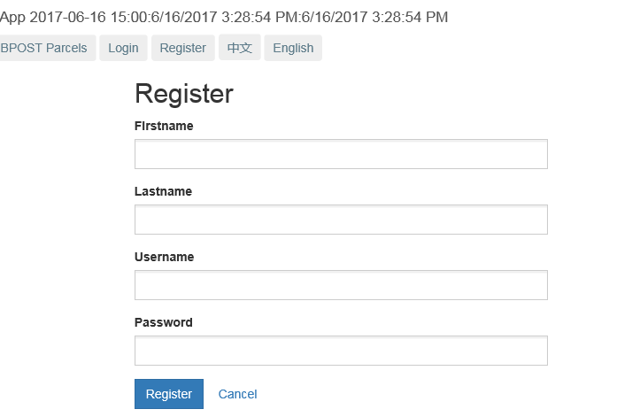
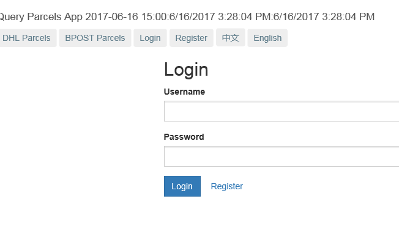
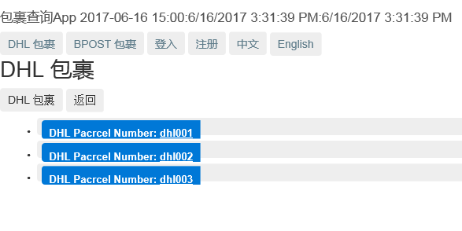

###install angular cli 1.1.1 , you need to have node >6, npm>3.10
```
npm install -g @angular/cli@1.1.1
```
###intall dependency for this project
```
npm install 
```
###start json-server data.json to mock backend REST Service
```
json-server data.json
```
###start project
```
ng serve , go to http://localhost:4200
```
###Start Mock Backend REST by below command
```
json-server data.json
```
###List DHL Parcels 




###List DHL Parcel in Detail




###List BPost Parcel in Detail, it has access control only allowed for login user





###It uses i18n feature, supports English and Chinese


