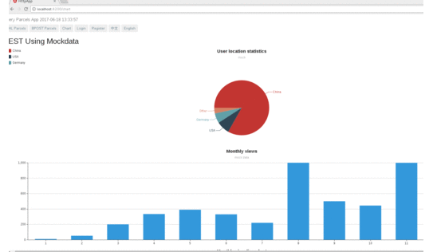
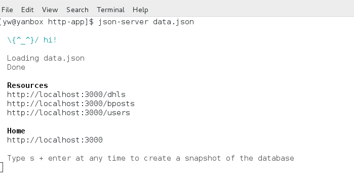
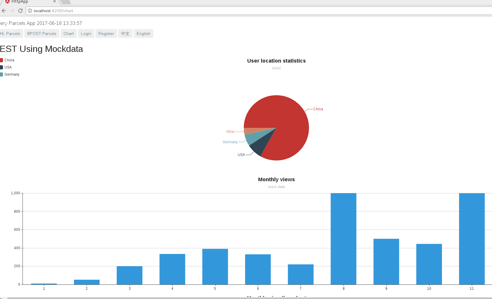

# Short Intro
It is a NG4 demo(Parcel Query App) with CRUD + Authorization  + i18N + Chart

# demo for query , register, login, chart, i18n, etc



# install angular cli 1.1.1 , you need to have node >6, npm>3.10
```
npm install -g @angular/cli@1.1.1
```
# intall dependency for this project
```
npm install 
```
# start json-server data.json to mock backend REST Service
```
json-server data.json
```

# start project - frontend
```
ng serve , go to http://localhost:4200
```
# display chart


# list DHL Parcels 


# list DHL Parcel in Detail


# list BPost Parcel in Detail, it has access control only for login user


# it uses i18n feature, supports English and Chinese


